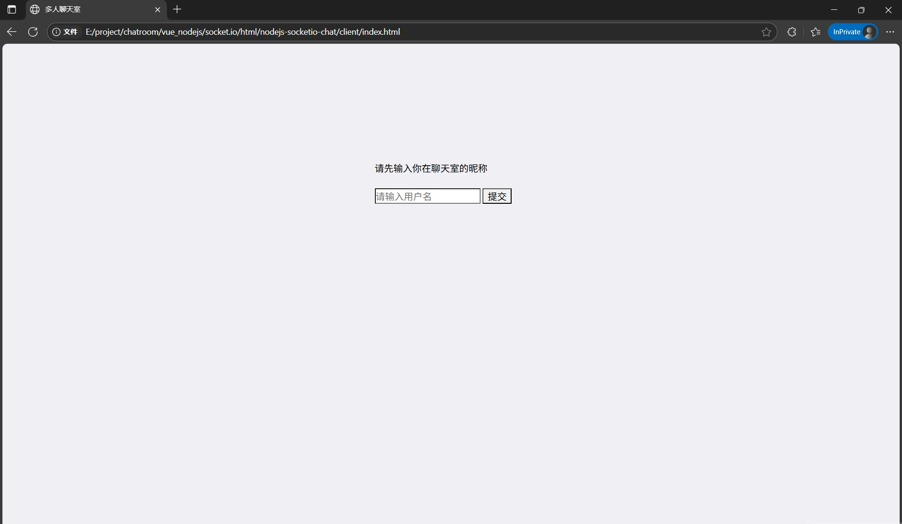
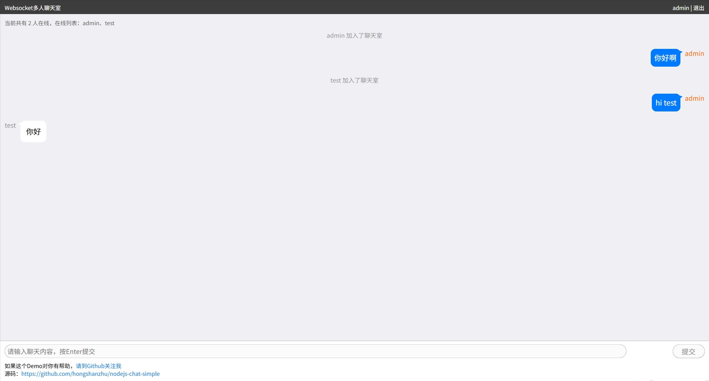

<h1 align="center">ChatRoom</h1>
<p align="center"><strong>This is a simple chat room demo by using Node.js and Socket.IO.</p>
<p align="center"><strong>一个基于nodejs+socket.io最简单的聊天室。<em>持续更新 ing～</em></strong></p>

<div align="center">
    <a href="https://github.com/hongshanzhu/nodejs-chat-simple"></a>
    <a href="https://github.com/hongshanzhu/nodejs-chat-simple/commits" target="_blank"><br>
    <a href="https://github.com/hongshanzhu/nodejs-chat-simple/commits" target="_blank">
        </a>
    <a href="https://github.com/hongshanzhu/nodejs-chat-simple/issues" target="_blank">
        
    </a> 
    <a href="https://github.com/hongshanzhu/nodejs-chat-simple/blob/master/LICENSE" target="_blank">
        
    </a> 
    <a href="https://github.com/hongshanzhu/nodejs-chat-simple/stargazers" target="_blank">
        
    </a> 
    
</div>

## Description

fontend  : html, css, javascript
backend  : Node.js, Socket.IO

## Run Server
```
cd server
npm install
node index.js
```


## Run client

```
cd client
open index.html in browser
```

## Demo



## License
[Apache License 2.0](./LICENSE)